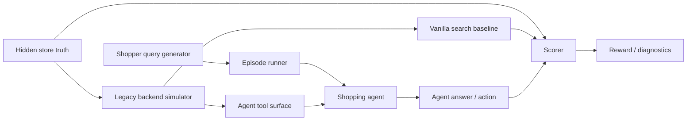
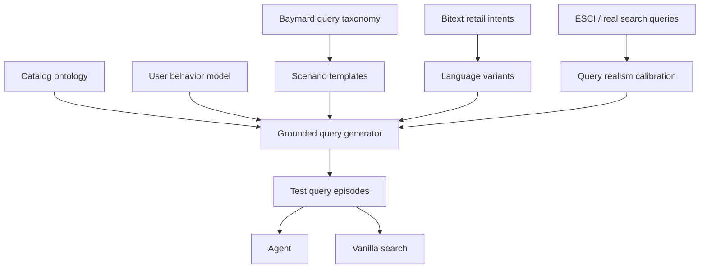

# ShopWorld × milli.run Execution Plan

_Date consolidated: 2026-06-22_

This is the canonical `platform-rnd/` planning document. Older research notes, prompt outputs, Shopify API notes, AppWorld migration sketches, GTM questions, and presentation artifacts have been moved to `platform-rnd/archive/` and should be treated as historical inputs, not active implementation contracts.

## 1. Product Claim

ShopWorld is a neutral simulated commerce world for evaluating merchant agents before granting live store authority.

The benchmark measures whether an agent can run merchant workflows safely under real store state, policy constraints, delayed consequences, and hidden simulator dynamics. It is not a support-chat benchmark and it is not a thin Shopify API mock.

Expected comparative shape:

- **milli.run** should be strongest on modeled, stateful, policy-constrained workflows where deterministic routing, guard checks, auditability, and transaction safety matter.
- **LLM agents** should be strongest on novel language, unsupported workflows, ambiguous dialogue, and open-ended conversation.
- The benchmark runner and evaluator stay neutral; they report empirical outcomes rather than favoring either agent class.

## 2. Core Boundary

| Boundary | Role |
| --- | --- |
| ShopWorld | Test environment: simulator, canonical store state, hidden world physics, evaluator, trace/replay, and reports. |
| Merchant API Surface | The only operational interface exposed to agents: Shopify-like Admin API, support inbox API, storefront/cart API, policy documents, tool schemas, and tool results. |
| milli.run | Neuro-symbolic merchant runtime under test, using FastText/SVM/entity extraction/state machines. |
| LLM Agent | LLM-powered tool-using merchant runtime under test. |
| Benchmark Runner | Neutral experiment loop that runs agents against identical scenarios and identical tool contracts. |
| Evaluator | Hidden scorer that reads canonical state, traces, policy outcomes, and reward vectors after an episode. |
| Reports | Comparative failure analysis, reward vector, trace replay, permission/readiness output, and diagnostics. |

### Non-negotiable design rule

Agents do **not** operate ShopWorld directly. They operate a simulated merchant through the Merchant API Surface.

Agents must never receive direct access to canonical database tables, hidden simulator state, scenario ground truth, evaluator logic, reward functions, future events, or expected actions.

```text
ShopWorld
= simulator + canonical store state + hidden world physics + evaluator

Merchant API Surface
= Shopify-like Admin API + support inbox API + exposed policy/tool contracts

milli.run
= neuro-symbolic merchant runtime using FastText/SVM/entity extraction/state machines

LLM Agent
= LLM-powered tool-using merchant agent

Benchmark Runner
= neutral loop that runs both agents against identical scenarios

Reports
= comparative failure analysis + reward vector + trace replay + readiness output
```

## 3. Architecture

```text
                ┌────────────────────────────┐
                │         ShopWorld           │
                │                            │
                │ canonical database          │
                │ hidden actor state          │
                │ customer simulator          │
                │ logistics simulator         │
                │ supplier simulator          │
                │ demand simulator            │
                │ policy supervisor           │
                │ evaluator                   │
                └─────────────┬──────────────┘
                              │
                              ▼
                ┌────────────────────────────┐
                │   Merchant API Surface      │
                │                            │
                │ Shopify-like Admin API      │
                │ support inbox API           │
                │ storefront/cart API         │
                │ policy documents            │
                │ tool schemas                │
                │ tool results                │
                └───────┬────────────┬───────┘
                        │            │
                        ▼            ▼
              ┌──────────────┐ ┌──────────────┐
              │   milli.run   │ │  LLM Agent   │
              └──────┬───────┘ └──────┬───────┘
                     │                │
                     └───────┬────────┘
                             ▼
                    Benchmark Runner
                             ▼
                    Comparative Report
```

## 4. Merchant API Surface

The Merchant API Surface is the exposed tool layer. It should be Shopify-like first, expose realistic commerce operations, and hide simulator internals.

| Tool Family | Initial Tools |
| --- | --- |
| Orders | `orders.query`, `orders.cancel`, `orders.update` |
| Customers | `customers.query`, `customers.update`, `customers.tag` |
| Fulfillment | `fulfillments.query`, `fulfillments.cancel`, `shipments.query` |
| Inventory | `inventory.query`, `inventory.adjust`, `inventory.reserve` |
| Refunds | `refunds.create`, `refunds.query` |
| Returns | `returns.create`, `returns.query` |
| Products | `products.query`, `products.update` |
| Discounts | `discounts.create`, `discounts.query` |
| Support | `tickets.query`, `tickets.reply`, `tickets.escalate` |
| Policy | `policy.lookup`, `policy.explain` |

### Agent-visible inputs

| Input | Description |
| --- | --- |
| Observation | Current ticket, event, or task-visible state. |
| Conversation history | Prior customer and agent messages. |
| Tool schemas | Available Shopify/support tools. |
| Tool results | Results from prior API calls. |
| Policy snippets | Merchant policies exposed through documents or tools. |
| Permission scope | Allowed read/write authority. |
| Time | Current simulated timestamp, if exposed. |

### Hidden ShopWorld state

ShopWorld maintains hidden state that agents cannot directly inspect.

| Hidden State | Purpose |
| --- | --- |
| Customer satisfaction | Drives churn, reviews, escalation, and future behavior. |
| Customer patience | Determines urgency and complaint escalation. |
| Fraud risk | Drives abuse scenarios and chargeback probability. |
| Supplier reliability | Drives future inventory and fulfillment failures. |
| Carrier reliability | Drives late/lost/damaged package events. |
| Demand trends | Drives inventory pressure and ad outcomes. |
| Promo fatigue | Drives diminishing returns on discounts. |
| Review probability | Drives long-horizon brand impact. |
| Chargeback probability | Drives financial risk. |
| Repeat purchase probability | Drives customer lifetime value. |


## 5. Shopper-Facing Commerce Simulator Capability

ShopWorld also includes a shopper-facing product-discovery benchmark in addition to merchant operations. This capability evaluates whether a shopping agent can reason over imperfect production-like commerce interfaces better than plain search, without exposing hidden catalog truth.

The setup is a **commerce simulator with hidden store truth, a realistic legacy search/data backend, and a constrained agent-facing tool surface that exposes only what a real shopping agent would plausibly get from production APIs**.



### Core realism problems

The shopper-facing benchmark has three realism problems:

1. **Store world**: catalog, ontology, inventory, policies, compatibility, variants, and dirty product data.
2. **Tool surface**: what the agent is allowed to ask, how much structure it gets, and how lossy the interface is.
3. **Query distribution**: whether test queries resemble real shoppers rather than benchmark-authored prompts.

The agent must not see the hidden ontology directly. It should interact with a production-shaped surface: search, facets, product details, compatibility checks, policy search, inventory, and constrained alias resolution. The evaluator separately holds the richer ground truth needed to score correctness.

### Realistic underlying store data model

The hidden store should look like a messy mid-market ecommerce backend, not a clean academic product table.

| Store object | Realistic contents | Hidden vs visible |
| --- | --- | --- |
| `products` | SKU, title, brand, description, category, price, status | Partly visible |
| `variants` | Size, color, fit, pack size, generation, material | Partly visible |
| `inventory` | Location, availability, backorder, delivery estimate | Visible through lookup |
| `categories` | Department, category, subcategory, browse tree | Partly visible |
| `attributes` | Structured specs, noisy extracted specs, missing values | Partly visible |
| `aliases` | Brand aliases, misspellings, model aliases, shorthand | Visible only through resolver |
| `compatibility_edges` | Device-model-to-accessory, part-to-appliance, substitutes | Hidden; exposed via scoped tool |
| `policies` | Returns, shipping, warranty, pickup, order tracking | Visible through policy search |
| `behavioral_logs` | Query, click, add-to-cart, purchase, reformulation | Hidden or used for generation |
| `relevance_labels` | Query to exact/substitute/complement/irrelevant labels | Hidden scorer only |

Postgres is a credible simulator for the relational and semi-structured source of truth because it supports relational data plus JSON-style product attributes, and `jsonb` fields can be indexed with GIN for key/value search. Solr is a credible simulator for the legacy ecommerce search layer because it supports fielded text analysis, eDisMax-style query parsing, boosting, and faceting. Schema.org Product is useful as an external sanity check for product fields, though it is too shallow to serve as the full hidden ontology.

Store realism checklist:

- Product titles contain marketing noise, abbreviations, units, model numbers, and variants.
- Product attributes are incomplete and category-specific.
- Some attributes exist only in text, not structured fields.
- Some products are miscategorized.
- Variant relationships are inconsistent.
- Price and inventory can change independently of catalog metadata.
- Compatibility is not derivable from keyword overlap alone.
- Policy pages are separate from product data.
- Search index data lags behind source-of-truth database state.
- Facets are useful but incomplete.
- The hidden evaluator knows more than the agent-facing API.

### Realistic dual surface

The cleanest framing is **dual surface = hidden truth surface + agent-visible production surface**.

| Surface | Who sees it | Purpose |
| --- | --- | --- |
| Hidden truth surface | Evaluator only | Scoring, oracle labels, full ontology, true compatibility |
| Legacy backend surface | Simulator internals | Postgres/Solr-style data services |
| Agent tool surface | Shopping agent | Constrained production-like APIs |
| Vanilla search surface | Baseline | Same search index without agent reasoning |

The agent gets a thin orchestration layer, not direct database access.

| Tool | Realistic behavior | Anti-oracle constraint |
| --- | --- | --- |
| `search_products(query, filters?, limit?)` | Solr/BM25/hybrid search over indexed catalog | Returns ranked candidates, not correct products |
| `get_product_details(product_ids)` | Product page data, specs, description, reviews | Only for retrieved or specified products |
| `list_facets(query_or_category)` | Available filters and counts | Returns exposed index facets only |
| `filter_products(query_or_category, filters)` | Apply category/attribute/price filters | Only supports public filter schema |
| `resolve_alias(text)` | Candidate brands/models/categories | Returns candidates with confidence, not truth |
| `check_compatibility(anchor, candidates)` | Scoped compatibility check | Requires candidate products; does not dump graph |
| `search_policies(query)` | Search support/policy corpus | No product relevance signal |
| `check_inventory(product_ids)` | Stock, fulfillment, delivery availability | Does not rank products |
| `compare_products(product_ids)` | Compare selected products | Only compares selected candidates |
| `ask_user(question)` | Clarification action | Penalized when unnecessary |

Avoid oracle tools such as `query_sql(sql)`, `get_all_products_matching_intent(query)`, `get_ontology_node(query)`, `get_compatible_products(model)`, `get_gold_relevance(query)`, and `classify_baymard_query_type(query)`. These leak simulator internals, gold labels, or benchmark taxonomies.

Use **Level 3** for the main RLE: search, facets, alias resolution, scoped compatibility, policy search, product details, and inventory. Vanilla search only is the baseline; direct ontology or SQL access is diagnostic only; gold relevance APIs are invalid.

### Why this tests the shopping agent

- The agent must decide whether the query is product, policy, compatibility, symptom, use-case, or mixed.
- The agent must choose retrieval strategy before seeing perfect structure.
- The agent must inspect enough products without brute-forcing the catalog.
- The agent must compose tools when keyword search is insufficient.
- The agent must know when not to recommend products.
- The scorer can measure whether the same tools are used more effectively than vanilla search.

### Realistic shopper-query distribution

Baymard should define ecommerce query-type coverage because it identifies common ecommerce search query classes such as exact, product type, feature, use case, abbreviation/symbol, compatibility, symptom, and non-product searches. Bitext should supply language variation and retail intent coverage, but not product relevance labels. Amazon's ESCI Shopping Queries dataset is useful for query realism because it includes difficult shopping queries with query-product relevance labels such as Exact, Substitute, Complement, and Irrelevant.



| Source | Use | Limitation |
| --- | --- | --- |
| Baymard taxonomy | Coverage of ecommerce search failure modes | Taxonomy, not a labeled query corpus |
| Bitext | Natural-language retail support phrasing | Chatbot data, not product-ranking gold |
| ESCI | Realistic product-search relevance patterns | Amazon domain may not match target vertical |
| Production logs | Best realism source if available | Privacy, bias, commercial sensitivity |
| Synthetic generation | Coverage and controllability | Must be calibrated against real logs |

| Episode class | Example | Required agent behavior |
| --- | --- | --- |
| Exact product | “Dyson V8 absolute battery” | Find exact or compatible item |
| Product type | “linen duvet cover” | Route to category and useful filters |
| Feature | “waterproof black hiking boots wide” | Apply hard filters |
| Use case | “gift for 8 year old who likes space” | Infer category and explain assumptions |
| Compatibility | “case for iphone 15 pro max” | Enforce compatibility |
| Symptom | “laptop gets too hot on desk” | Map problem to solution categories |
| Abbreviation/symbol | `13" laptop sleeve under $40` | Normalize units and constraints |
| Non-product | “how long do returns take” | Route to policy answer |
| Mixed | “waterproof trail shoes, can I return if they don't fit?” | Product search plus policy support |

Realism validation loop:

1. Build synthetic queries from templates.
2. Mix in Bitext-style language variants.
3. Mix in ESCI or production-log queries where available.
4. Run vanilla search.
5. Identify whether failures resemble known ecommerce search failures.
6. Label gold products, categories, filters, policy routes, and acceptable clarifications.
7. Reject episodes where the answer is only obvious because the synthetic author encoded it too cleanly.
8. Reject episodes where no reasonable tool strategy can recover the answer.
9. Keep adversarial noise but preserve shopper plausibility.

### Proposed shopper benchmark stack

```text
Postgres-like source of truth
+ Solr/BM25-style search index
+ policy/document search index
+ scoped compatibility service
+ constrained MCP-style tool wrapper
+ hidden evaluator ontology
+ Baymard/Bitext/ESCI/log-derived query generator
+ vanilla search baseline
+ reward scorer
```

Concrete hidden data model:

```text
products(product_id, parent_product_id, title, brand, category_id, description, price, active_status)
product_variants(variant_id, product_id, color, size, material, pack_size, model, gtin, mpn)
product_attributes(product_id, attribute_name, attribute_value, source, confidence)
inventory(product_id, location_id, availability_status, quantity, delivery_days)
categories(category_id, parent_category_id, name, path)
aliases(alias_text, canonical_type, canonical_id, confidence)
compatibility_edges(anchor_type, anchor_id, product_id, relation_type, confidence)
policies(policy_id, title, body, policy_type)
search_logs(query, clicked_product_ids, purchased_product_ids, reformulated_query, timestamp)
relevance_labels(episode_id, product_id, label)
```

Concrete shopper tool contract:

```text
search_products(query, filters=None, limit=20)
list_facets(query=None, category_id=None)
get_product_details(product_ids)
resolve_alias(text, types=None)
filter_products(query=None, category_id=None, filters=None, limit=20)
check_compatibility(anchor_text, candidate_product_ids)
search_policies(query, limit=5)
check_inventory(product_ids)
```

| Scoring dimension | Hidden evaluator uses |
| --- | --- |
| Retrieval quality | Gold query-product labels |
| Constraint fidelity | Hidden normalized attributes |
| Compatibility correctness | Hidden compatibility graph |
| Non-product routing | Hidden policy-route labels |
| Baseline lift | Vanilla search output |
| Tool-use quality | Tool call trace |
| UX quality | Final answer and clarification behavior |
| Robustness | Query variants and perturbations |

The most important design principle is that the agent-facing surface should be **strong enough to make success possible but weak enough that success requires composition**.

| Query | Vanilla search likely does | Good agent does |
| --- | --- | --- |
| “xps 13 9310 charger” | Finds generic Dell chargers | Resolves model, retrieves candidates, checks compatibility |
| “black dress wedding guest summer” | Returns black dresses | Infers occasion/season, filters fabric/style, avoids bridal items |
| “stroller that fits in overhead bin” | Keyword matches stroller | Maps use case to compact travel stroller dimensions |
| “my rug smells like dog” | Returns rugs | Maps symptom to cleaners/deodorizers, maybe pet-safe filter |
| “return shoes after wearing once” | Returns shoes | Searches return policy and answers policy constraint |

### Shopper capability MVP

1. Build one vertical first, such as electronics accessories, apparel, home goods, or beauty.
2. Use 5k to 20k products; small catalogs are too clean.
3. Store canonical truth in Postgres-style tables.
4. Create a Solr/BM25-style search index with intentionally imperfect analyzers and boosts.
5. Expose only Level 3 tools to the agent.
6. Generate 2k to 5k episodes across Baymard query types.
7. Use Bitext to diversify wording and support/policy intents.
8. Use ESCI or logs to calibrate query/product relevance style.
9. Score against hidden labels and vanilla search.
10. Run ablations with fewer tools and oracle tools to establish floor and ceiling.

Final shopper architecture in one line:

```text
Realistic shopper-query generator
→ constrained agent-visible commerce tools
→ messy store/search backend
→ hidden evaluator ontology
→ baseline-relative reward
```

## 6. Data and Leakage Rules

Bitext and DSPy-derived assets are absorbed into the environment and implementation. They are not separate systems under test.

| Resource | Integrated Into | Purpose |
| --- | --- | --- |
| Bitext customer-support dataset | ShopWorld scenario generator | Support-ticket language, intents, entities, and linguistic variants. |
| Bitext retail-ecommerce dataset | ShopWorld scenario generator | Storefront, cart, checkout, and product-help language. |
| DSPy facility-support repo | milli.run NLU and experiment harness | FastText/SVM patterns, metrics, and comparison structure. |
| Shopify Admin GraphQL | Merchant API Surface | Primary agent operation interface. |
| Archived ShopWorld plans | Environment product spec | Deterministic simulator, state, actors, evaluation, and readiness reporting. |

Data leakage controls:

1. Keep separate data splits for NLU training, scenario generation, and held-out ShopWorld tests.
2. Do not reuse milli.run NLU training language as held-out ShopWorld test language.
3. Track every scenario-generation seed utterance by split and provenance.
4. Do not expose labels, expected workflows, evaluator assertions, reward functions, or scenario ground truth to LLM agents.
5. Do not expose simulator ground truth to milli.run except through the same Merchant API Surface available to LLM agents.

## 7. Module Ownership

### ShopWorld owns

| Component | Responsibility |
| --- | --- |
| Canonical database | True store state. |
| Scenario generator | Creates initial state, events, policies, hidden state, and variants. |
| Actor simulators | Customers, suppliers, logistics, demand, ads, and shoppers. |
| Shopify-like API implementation | Validates and executes exposed tool calls. |
| Support inbox | Manages customer conversations and tickets. |
| Clock | Advances simulated time deterministically. |
| Evaluator | Scores final state and trace. |
| Trace/replay | Captures agent actions, tool calls, state diffs, and replay metadata. |
| Report generator | Produces comparative result summaries and readiness reports. |

ShopWorld must not contain milli.run-specific routing, state machines, NLU logic, prompt policy, or agent implementation details.

### milli.run owns

| Component | Responsibility |
| --- | --- |
| FastText classifier | Fast support/retail intent classification. |
| SVM classifier | Strong shallow classification baseline. |
| Entity extractor | Order IDs, emails, products, dates, addresses, and refund amounts. |
| Confidence router | Routes low-confidence cases to clarification or escalation. |
| Workflow state machine | Encodes known merchant workflows. |
| Ontology view | Represents merchant objects as operational concepts. |
| Policy guards | Prevents invalid refunds, cancellations, discounts, and address changes. |
| Transaction planner | Creates safe read/write plans. |
| Commit/rollback logic | Handles failed operations and partial writes. |
| Response templates | Produces controlled customer-facing replies. |
| Audit layer | Records reasoning, guards, reads, writes, and escalation decisions. |

milli.run must access ShopWorld only through the Merchant API Surface.

### LLM agent owns

| Component | Responsibility |
| --- | --- |
| Prompt policy | Describes merchant rules and behavioral constraints. |
| Tool-use loop | Calls Merchant API tools. |
| Planner | Chooses next action. |
| Memory/context window | Tracks ticket and tool history. |
| Response generator | Writes customer-facing messages. |
| Escalation logic | Decides when to route to human review. |

The LLM agent must access ShopWorld only through the Merchant API Surface.

### Benchmark runner owns

The runner is the neutral experiment loop:

```text
1. Load scenario.
2. Reset ShopWorld with scenario seed.
3. Reset evaluated agent.
4. Provide initial observation and tool schemas.
5. Receive agent action.
6. Execute action through Merchant API Surface.
7. Return tool result or updated observation.
8. Continue until termination.
9. Run evaluator.
10. Save trace.
11. Compare agent outcomes.
```

The runner must not give one agent more privileged information than another.

## 8. Initial Scenario Families

The first benchmark should focus on workflows where state changes the correct answer.

| Scenario Family | Example Surface Request | State-Dependent Correct Behavior |
| --- | --- | --- |
| WISMO | “Where is my order?” | Depends on label, carrier scan, delay, lost package, or delivered-not-received state. |
| Cancellation | “Cancel my order” | Depends on payment, fulfillment, shipment, delivery, or fraud hold state. |
| Address change | “Change my shipping address” | Depends on label creation, fulfillment status, and carrier intercept availability. |
| Refund | “I want a refund” | Depends on policy window, delivery status, return state, and abuse risk. |
| Return | “How do I return this?” | Depends on SKU, condition, return window, and final-sale status. |
| Wrong item | “You sent the wrong item” | Depends on inventory, replacement availability, and supplier/batch state. |
| Damaged package | “My item arrived damaged” | Depends on carrier evidence, photo requirement, and replacement stock. |
| Payment issue | “I was charged twice” | Depends on payment gateway state and authorization/capture/refund records. |
| Invoice request | “Send me my invoice” | Depends on customer identity and order ownership. |
| Promo issue | “My discount code failed” | Depends on discount rules, cart contents, expiration, and customer eligibility. |

## 9. Evaluation Layers

Evaluation must separate shallow NLU from operational success.

| Layer | Measures | Expected Advantage |
| --- | --- | --- |
| NLU | Intent accuracy, entity F1, confidence calibration. | milli.run FastText/SVM likely strong. |
| Store grounding | Correct API reads and disambiguation. | milli.run likely strong on modeled workflows. |
| State reasoning | Correct guard evaluation and state transition. | milli.run likely strong. |
| Transaction safety | Correct mutation, rollback, and no collateral damage. | milli.run likely strong. |
| Policy compliance | No unauthorized actions and correct escalation. | milli.run likely strong. |
| Language flexibility | Ambiguous phrasing, unseen workflows, open-ended dialogue. | LLM likely strong. |
| Business outcomes | Margin, refunds, chargebacks, churn, and stockouts. | Empirical. |
| Runtime | Latency, cost, and determinism. | milli.run likely strong. |
| Auditability | Trace completeness and replayability. | milli.run likely strong. |

### Failure taxonomy

| milli.run Failure | Description |
| --- | --- |
| Missing ontology | Store concept is not modeled. |
| Missing workflow | Request maps to unsupported workflow. |
| Parser miss | Intent/entity extraction is wrong. |
| Confidence miss | Low-certainty case is not clarified or escalated. |
| Guard gap | Policy constraint is not encoded. |
| Over-rigidity | System fails on a novel but reasonable exception. |
| Template limitation | Response feels too rigid or underspecified. |

| LLM Failure | Description |
| --- | --- |
| Hallucinated state | Claims shipment/refund/order state not supported by tools. |
| Wrong mutation | Updates wrong order, customer, refund, or inventory record. |
| Policy drift | Ignores refund, cancellation, discount, or escalation rules. |
| Contradictory promise | Promises something unsupported by actual store state. |
| Tool misuse | Uses wrong API, wrong arguments, or wrong sequence. |
| Collateral damage | Changes unrelated records. |
| Weak audit | Cannot produce deterministic explanation of action chain. |

## 10. MVP Scope

The first MVP should avoid the earlier full 100-scenario target and ship one deterministic vertical slice first.

| Area | Target |
| --- | --- |
| Support examples | 500 Bitext-support-derived utterances. |
| Retail examples | 500 Bitext-retail-derived utterances. |
| Grounded scenarios | 30 manually verified scenarios. |
| Hidden-state variants | 5 per main workflow. |
| Agents | milli.run and one LLM tool agent. |
| Tools | 10 to 15 Merchant API tools. |
| Workflows | WISMO, cancellation, address change, refund, and return. |
| Reports | Comparative failure-mode report. |
| Trace replay | Required. |
| Determinism | Required. |

## 11. Repository Split

```text
shopworld/
  src/shopworld/
    core/
      env.py
      clock.py
      observations.py
      actions.py
    state/
      schema.py
      seed.py
      snapshots.py
    api_surface/
      shopify_admin.py
      support_inbox.py
      storefront.py
      policy.py
    simulators/
      customers.py
      logistics.py
      suppliers.py
      demand.py
      ads.py
    scenarios/
      bitext_support_importer.py
      bitext_retail_importer.py
      generators.py
      specs/
    evaluation/
      evaluator.py
      reward_vector.py
      collateral_damage.py
      policy_checks.py
      diagnostics.py
    traces/
      logger.py
      replay.py
```

```text
milli_run/
  src/milli_run/
    nlu/
      fasttext_model.py
      svm_model.py
      entity_extractor.py
      confidence.py
    workflows/
      track_order.py
      cancel_order.py
      change_address.py
      refund.py
      return_item.py
    transactions/
      planner.py
      guards.py
      commit.py
      rollback.py
    templates/
      responses.py
    audit/
      logger.py
    agent.py
```

```text
llm_agent/
  src/llm_agent/
    prompts/
      merchant_system.md
      policy_context.md
    tool_agent.py
    react_loop.py
    agent.py
```

```text
experiments/
  configs/
    mvp_30.yaml
  run_benchmark.py
  compare_agents.py
  reports/
```

## 12. Execution Sequence

1. Build ShopWorld core reset/step loop.
2. Build canonical store schema.
3. Build Merchant API Surface.
4. Build support inbox API.
5. Build first scenario generator from Bitext support.
6. Build first scenario generator from Bitext retail.
7. Build five state-dependent workflow families.
8. Build evaluator for final-state and trace scoring.
9. Build milli.run NLU adapter using FastText/SVM patterns.
10. Build milli.run workflow router and transaction guards.
11. Build LLM tool-use agent against identical tools.
12. Run 30-scenario MVP benchmark.
13. Produce failure taxonomy report.
14. Expand scenario count and hidden-state variants.
15. Add long-horizon delayed-consequence episodes.

## 13. Definition of Done for MVP

| Requirement | Done When |
| --- | --- |
| Environment separation | ShopWorld runs without milli.run or LLM agent imports. |
| Agent interface equality | Both agents use identical Merchant API Surface. |
| Determinism | Same seed and actions produce same trace and final state. |
| Scenario grounding | Same utterance can produce different correct actions under different store states. |
| NLU benchmark | milli.run reports intent/entity performance separately. |
| State benchmark | Evaluator reports database-read and transition correctness. |
| Transaction benchmark | Evaluator catches invalid mutation and collateral damage. |
| Policy benchmark | Evaluator catches refund/cancellation/address-change violations. |
| Failure report | Report separates milli.run failures from LLM failures. |
| Trace replay | Any failed episode can be replayed deterministically. |

## 14. Archived Inputs and Retained Context

Historical files remain in `platform-rnd/archive/` for provenance only. Relevant retained ideas are already folded into this document:

- AppWorld contributes the pattern of a resettable world, typed APIs, task-specific initial state, programmatic evaluators, execution logs, trace replay, and collateral-damage checks.
- Prior ShopWorld specs contribute the merchant-readiness framing, Shopify-like Admin GraphQL orientation, synthetic actors, hidden state, delayed business consequences, and permission-scope reporting.
- Shopify GraphQL notes contribute the need for realistic commerce boundaries, typed objects, pagination/cost constraints, and operationally faithful tool design.
- Business/GTM notes remain useful for customer discovery, but they do not define the MVP architecture.
- Amazon/multi-channel ideas, poster assets, and raw prompts are backlog or communication artifacts, not implementation requirements.

## 15. Current Active Contract

When planning or implementing ShopWorld from `platform-rnd/`, use this file as the active product and architecture contract. If an archived note conflicts with this document, this document wins unless a future PR explicitly supersedes it.
