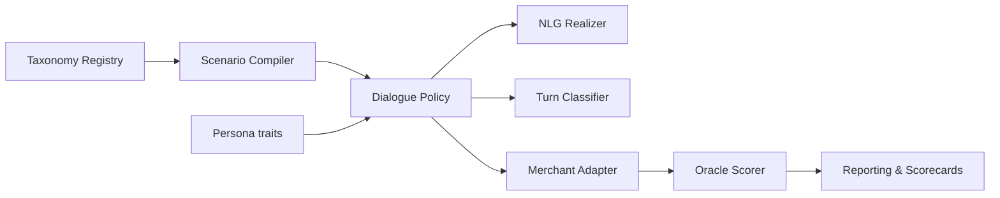

# Shopper Simulator: Developer Explainer

Welcome to the **Shopper Simulator** repository! This document serves as an orientation guide to help you understand what this project does, how its codebase is structured, and how to use it to build and evaluate e-commerce experiences.

---

## 🎯 The Core Philosophy: Deterministic Grader

When evaluating conversational merchant agents or web storefronts, the most common source of noise is the **shopper**. LLM-driven test shoppers are slow, expensive, and non-deterministic—making it hard to know if a drop in score is a regression in your agent or just a random variation in the shopper's phrasing.

**Shopper Simulator flips this dynamic:**
* The **Shopper is 100% deterministic, reproducible, and LLM-free** at runtime.
* The same combination of `(Scenario, Persona, Seed)` always generates the exact same shopper behavior and utterances, byte-for-byte, across processes and runs.
* All variability is pushed onto the **Merchant Under Test**. By running a scenario $K$ times, any variance in the final score is mathematically attributable to the merchant (e.g., agent stochasticity).

---

## 🧱 Key Concepts & Vocabulary

Before diving into the code, familiarize yourself with these key domain terms defined in [types.py](file:///Users/kripar/Documents/coding/shopper_sim/shopper_sim/engine/types.py):

* **Query Family**: A leaf category representing a specific shopper intent (e.g., `returns_policy` or `order_editing`). There are exactly **52 macro query families** representing the complete shopper journey.
* **Intent Layer**: A roll-up layer for scoring. The 52 families roll up into 7 layers: `product`, `transaction`, `fulfillment`, `exception`, `return`, `account`, and `vertical`.
* **Persona**: An archetype representing a specific buyer's personality (e.g., price sensitivity, tech fluency, patience, risk aversion) as a vector of floats between `0.0` and `1.0`. Modulates dialogue decisions and text phrasing.
* **Goal**: An individual objective on the shopper's stack. A goal defines:
  * `preconditions`: Journey state that must exist before this goal can be pursued (e.g., you cannot edit an order until it is located).
  * `establishes`: State keys set upon goal satisfaction.
  * `info_slots`: Data the shopper is willing to provide (e.g., `order_id`).
* **Factsheet**: The ground-truth database of what the shopper knows. The shopper **only** answers questions using details in the factsheet and **never volunteers** information without being asked.
* **Scenario**: A compiled test case containing a starting Goal stack, a Factsheet, an initial journey state, a recommended Persona, and a content-addressable `scenario_id`.

---

## 🗺️ Architectural Structure

The project is structured into seven modular, decoupled subsystems. Data flows left-to-right through the codebase:



### 1. Engine & Determinism Spine (`shopper_sim/engine/`)
* **[rng.py](file:///Users/kripar/Documents/coding/shopper_sim/shopper_sim/engine/rng.py)**: Implements `DeterministicRNG` which wraps `numpy.random.Generator(PCG64)`. Child seeds are derived by hashing labels using BLAKE2b (avoiding stdlib `random` or time-based seeding).
* **[hashing.py](file:///Users/kripar/Documents/coding/shopper_sim/shopper_sim/engine/hashing.py)**: Handles content-addressable hashing. Generates a root hash pinning the scenarios, personas, engine version, and repeats so runs can be compared safely.

### 2. Taxonomy & Scenario Compiler (`shopper_sim/taxonomy/`)
* **[registry.py](file:///Users/kripar/Documents/coding/shopper_sim/shopper_sim/taxonomy/registry.py)**: The single source of truth for the 52 macro query families. Defines `HARD_CORE_MULTISTEP` families (12 families that inherently require multiple turns and cannot be tested single-shot).
* **[scenario_compiler.py](file:///Users/kripar/Documents/coding/shopper_sim/shopper_sim/taxonomy/scenario_compiler.py)**: Compiles families and templates into immutable, content-addressed `Scenario` objects. Compiling with overlays automatically expands generic scenarios into vertical-specific test cases (e.g., adding sizing constraints for apparel).
* **[graph.py](file:///Users/kripar/Documents/coding/shopper_sim/shopper_sim/taxonomy/graph.py)**: An in-memory property graph (`JourneyGraph`) of dependencies. Walks paths to generate random, precondition-linked multi-step scenarios.
* **[falkor_store.py](file:///Users/kripar/Documents/coding/shopper_sim/shopper_sim/taxonomy/falkor_store.py)**: Optional database layer using **FalkorDB** to sync, load, and query the journey graph using Cypher.

### 3. Persona (`shopper_sim/persona/`)
* **[library.py](file:///Users/kripar/Documents/coding/shopper_sim/shopper_sim/persona/library.py)**: Exposes 8 fixed personas (e.g., `anxious_gifter`, `bargain_hunter`).
* **[behavior.py](file:///Users/kripar/Documents/coding/shopper_sim/shopper_sim/persona/behavior.py)**: Models shopper decisions, such as when to push back, rephrase, escalate, or abandon a journey based on their traits.

### 4. Controllable NLG (`shopper_sim/nlg/`)
* **[realizer.py](file:///Users/kripar/Documents/coding/shopper_sim/shopper_sim/nlg/realizer.py)**: Selects registers (terse vs. polite) and formats frozen template phrases with slot values. Optionally injects typos/abbreviations for low-fluency personas.

### 5. Harness & Adapters (`shopper_sim/adapters/`)
* **[dialogue_policy.py](file:///Users/kripar/Documents/coding/shopper_sim/shopper_sim/adapters/dialogue_policy.py)**: The state machine managing the shopper's goals. Tracks budgets and limits to prevent infinite loops.
* **[turn_classifier.py](file:///Users/kripar/Documents/coding/shopper_sim/shopper_sim/adapters/turn_classifier.py)**: Evaluates merchant turns using keyword overlap banks. Operates **fail-closed**; borderline inputs fallback to `AMBIGUOUS` to avoid over-flattering the agent.
* **[agent_adapter.py](file:///Users/kripar/Documents/coding/shopper_sim/shopper_sim/adapters/agent_adapter.py)**: Conversation connector (HTTP & MCP) for AI agents.
* **[web_adapter.py](file:///Users/kripar/Documents/coding/shopper_sim/shopper_sim/adapters/web_adapter.py)**: Playwright adapter that runs against live DOM pages.

### 6. Oracle & Scoring (`shopper_sim/oracle/`)
* **[scorer.py](file:///Users/kripar/Documents/coding/shopper_sim/shopper_sim/oracle/scorer.py)**: Evaluates transcripts against the scoring rubric.
* **[rubric.py](file:///Users/kripar/Documents/coding/shopper_sim/shopper_sim/oracle/rubric.py)**: Scores are weighted on 5 dimensions:
  * `task_success` (40%): Goals completed.
  * `correctness` (25%): Penalities for illegal questions, unnecessary clarify loops, and precondition failures.
  * `efficiency` (15%): actual turn count relative to the theoretical optimum.
  * `disclosure` (10%): Surfacing necessary policies/fees early.
  * `recovery` (10%): Graceful handling of support escalations/handoffs.

### 7. Orchestration & Reporting (`shopper_sim/orchestrator/`, `shopper_sim/reporting/`)
* **[runner.py](file:///Users/kripar/Documents/coding/shopper_sim/shopper_sim/orchestrator/runner.py)**: Schedules and runs the scenario matrix.
* **[scorecard.py](file:///Users/kripar/Documents/coding/shopper_sim/shopper_sim/reporting/scorecard.py)**: Aggregates metrics, provides terminal formatting, and calculates delta diffs between model generations.

---

## 🚀 Running the Simulator

### Terminal Command Line Interface
Run these command-line tools using `uv` to interact with the simulator:

```bash
# Print the 52-family matrix mapping
uv run shopper-sim coverage

# Run the battery against the built-in GoodMerchant mock
uv run shopper-sim run --merchant good --k 5

# Compare performance (clueless merchant vs. good merchant)
uv run shopper-sim demo-diff

# Sync journey graph into FalkorDB and query prerequisite paths into refunds
uv run shopper-sim graph-sync --show-into refunds

# Run the back-and-forth multi-step conversation example script
uv run python examples/show_multistep_dialogue.py
```

---

## 🛠️ How to Grade a Real Merchant

To grade your own AI merchant agent, follow these steps:

### 1. Conversational HTTP API
If your agent exposes a chat endpoint, you can use the `HTTPAgentAdapter`. By default, it sends a POST request with:
```json
{
  "message": "Shopper message text",
  "session_id": "unique-session-guid",
  "history": [["shopper", "hi"], ["agent", "hello!"]]
}
```
And expects:
```json
{
  "reply": "Agent response text"
}
```

If your schema differs, you can supply a custom `request_builder` and `response_parser` (see [grade_real_agent.py](file:///Users/kripar/Documents/coding/shopper_sim/examples/grade_real_agent.py)):

```python
from shopper_sim import run_battery, compile_full_battery, all_personas
from shopper_sim.adapters.agent_adapter import HTTPAgentAdapter

def custom_builder(utterance, session_id, history):
    return {"query": utterance, "chatId": session_id}

def custom_parser(response_json):
    return response_json["answer"]

run = run_battery(
    scenarios=compile_full_battery(),
    personas=all_personas(),
    adapter_factory=lambda s: HTTPAgentAdapter(
        "https://my-store.com/api/chat",
        request_builder=custom_builder,
        response_parser=custom_parser
    ),
    k_repeats=3
)
```

### 2. Web Storefront (Playwright)
To test visual interfaces (such as a checkout flow or support form), instantiate the `PlaywrightWebAdapter` passing a `PageModel` preset that maps semantic actions (like clicking checkout, entering shipping fields) into CSS selectors.

---

## 🛡️ Testing & Guidelines

Always run the test suite to verify your changes did not violate determinism guarantees:
```bash
uv run pytest
```

> [!IMPORTANT]
> **Determinism Golden Rules:**
> 1. Never import or use Python's standard `random` module or unseeded `numpy` calls. Use the passed `DeterministicRNG` instance.
> 2. Avoid using time-dependent fields (like `datetime.now()`) or machine-specific environment configurations in the simulation flow.
